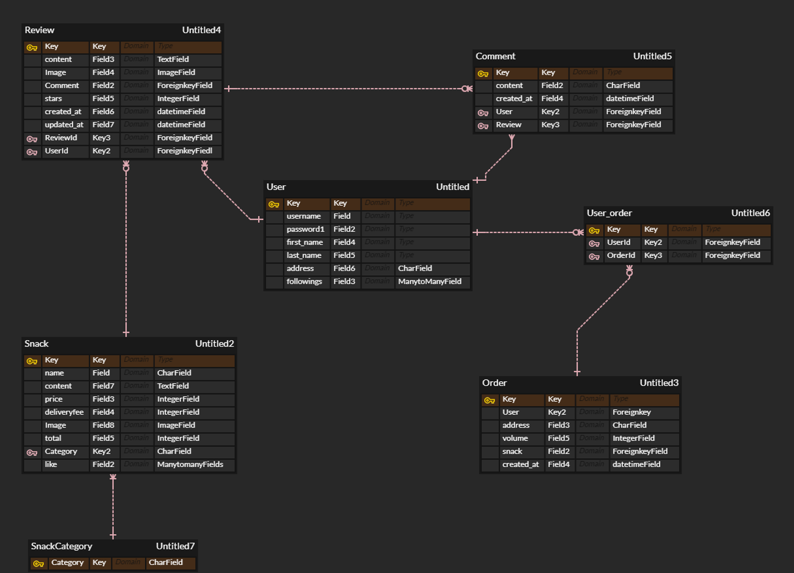
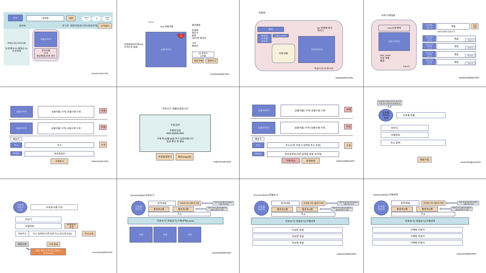
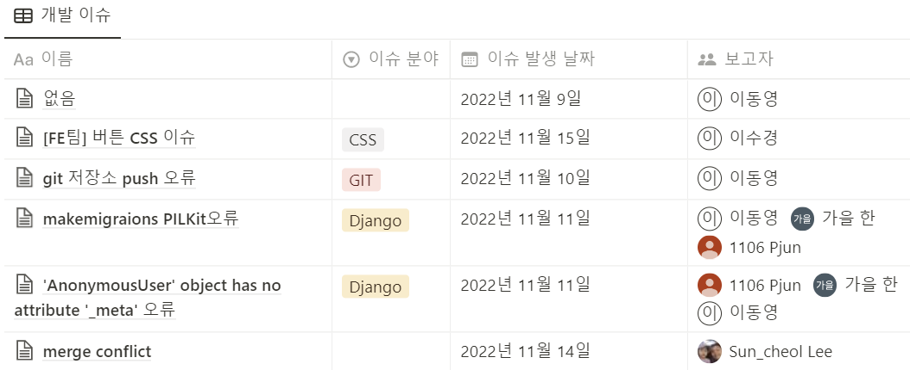

# 🗂️ 2022 Semi Project Ⅱ

> 서비스 이름 : 순삭(SOONSAK)
>
> 서비스 소개 : 회원제 수입 · 국내 · 수제과자 쇼핑몰
>
> 제작 기간 : 2022-11-09 ~ 2022-11-21
>
> 팀 구성 : 16팀 SOONSAK / 강문주, 박상준, 이동영,  [이수경](https://github.com/code-sum), 이순철, 한가을
>
> 결과 : 전체 20팀 중 공동4위 [아차상]
>
> 🌐 Link : http://soonsak-env.eba-rnwyi2s3.ap-northeast-2.elasticbeanstalk.com/
>
> ---
>
> < Contents >
>
> [1. 프로젝트 개요](#1-프로젝트-개요)
>
> [2. 프로젝트 기획](#2-프로젝트-기획)
>
> [3. 프로젝트 설계](#3-프로젝트-설계)
>
> [4. 기능 구현](#4-기능-구현)
>
> [5. 성과](#5-성과)
>
> ---

## 1. 프로젝트 개요

#### 1-1. 요구사항 명세

> 아래 조건을 만족하는 회원제 커뮤니티 서비스 개발

- **CRUD** 구현
- **Staticfiles** 활용 정적 파일(images, CSS, JS) 다루기
- **Django Auth** 활용 회원 관리 구현
- **Media** 활용 동적 파일 다루기
- 모델간 **1 : N** 관계 매핑 코드 작성 및 활용
  - 유저 - 리뷰
  - 유저 - 댓글
  - 리뷰 - 댓글

#### 1-2. 기대 효과

>  회원제 수입 · 국내 · 수제과자 쇼핑몰

- 유사 서비스 분석
  - 레퍼런스 사이트 : [스낵24](https://www.wefuncorp.com/snack), [간식뱅크](https://osmall.kr/), [과자몰](https://smartstore.naver.com/cookieall)
  - 회사원, 수험생을 대상으로 간식 판매 및 리뷰 공유 서비스 필요 
  - '수입과자', '수제과자' 등 상품 카테고리의 다양화 필요
- 바쁜 직장인, 학생들이 다양한 카테고리의 간식을 간편하게 주문할 수 있는 서비스 제작
- 관리자 계정 로그인 시, 상품 재고 및 배송 관리까지 가능할 수 있게 함
- 카카오 간편 로그인 기능을 구현하여, 사용자의 서비스 접근성을 높임

#### 1-3. 역할 분담

- [**이수경**](https://github.com/code-sum) Frontend
  - 프로젝트 베이스 코드 작성
  - 회원관리 기능 구현 (회원가입/탈퇴, 정보수정, 로그인/로그아웃 등)
  - 서비스 프론트엔드 기능 가운데 40% 기획 및 구현
  - AWS 와 GitHub Actions 를 이용한 CI/CD 배포 업무 전담
- **이동영** Backend / 팀장
- **한가을** Backend
- **이순철** Frontend
- **강문주** Frontend
- **박상준** Backend

## 2. 프로젝트 기획

#### 2-1. 핵심 기능

- 아임포트를 활용한 온라인 결제 모듈
- 관리자 - 상품 재고 및 배송 관리 시스템
- 사용자
  - 여러 개의 제품을 장바구니에 담아 한꺼번에 결제
  - 개인 프로필에서 구매내역 및 리뷰/댓글 관리

- 팔로잉/팔로워/글작성/댓글작성에 따라 활동지수 차등 적용
- 활동지수 랭킹에 따라 배송비 무료 기능
- 카카오 간편 로그인 기능

#### 2-2. 개발 환경

                  

- Programming Language : Python
- Script Language (Client) : JavaScript (ES6+)
- Framework : Django (3.2.13)
- Library / Package : Bootstrap (5.2.2), jQuery (3.6.1)
- Web : HTML 5, CSS 3
- SCM : Git
- DB : PostgreSQL, SQLite 3
- Deploy : AWS S3/RDS/EC2, Github Actions
- IDE : Visual Studio Code
- Tools : Github, Notion, .ENV

## 3. 프로젝트 설계

#### 3-1. DB 설계 (E-R 다이어그램)

#### 3-2. 화면 설계

## 4. 기능 구현

#### 4-1. 기능별 소스코드

- 회원관리 기능 (`/accounts`)
- 상품관리 기능 (`/snacks`)
- 장바구니 기능 (`/carts`)
- 주문관리 기능 (`/orders`)
- 리뷰/댓글 관리 기능 (`/reviews`)

#### 4-2. 문제 해결

## 5. 성과

#### 5-1. 수상내역

#### 5-2. 프로젝트 후기

- **강문주** : 팀원들의 배려와 열의 덕분에 많이 배우고 부족하지만 열심히 할 수 있었습니다. 혼자서는 할 수 없었던 일들을 이뤄낸 멋진 팀원들에게 함께 하는 것만으로도 감사한 프로젝트였습니다. 
- **박상준** : 부족한 부분이 많았지만 팀원분들이 도와주셔서 잘 마무리 되었다고 생각합니다. 앞으로 스스로 할 수 있게끔 더 공부해서 프로젝트에 도움이 되면 좋겠습니다.
- **이동영** (팀장)
  1. GOOD
     - 계획한대로 기본+추가 기능구현이 되었다.
     - 팀원의 역할 분담이 잘되었다.
     - 계획한대로 일정을 진행되서 일정내에 프로젝트를 완성했다.
     - 본격적인 개발전 개발 계획 회의를 긴시간 진행해서 개발중 의견 충돌이 없었다.
  2. ㅠㅠ
     - 하루~이틀에 한번 팀원 전체가 모여 코드리뷰를 했으면 더 좋았을것 같다.
     - 글작성 CRUD, 회원가입은 테스트 코드를 작성했으면 개발 시간을 단축할 수 있었을 것 같다.
  3. 팀에게
     - 팀원들 모두 고생했다. 모두 각자 역할을 잘 해줬다. 모두가 주어진 역할 뿐만 아니라 더 많은 것을 프로젝트에 담으력도 노력해줘서 프로젝트가 잘 완성될 수 있었다. 팀원 누구라도 다음에 또 같은 팀이 된다면 좋은 프로젝트가 될 것 같다.
- [**이수경**](https://github.com/code-sum) : 백엔드 포지션에 익숙하던 제가 프론트엔드 개발 업무를 맡아 이렇게 열심히 참여한 적이 처음이고, AWS 를 활용해서 배포 업무를 담당한 것도 처음이었기에 정말 특별한 경험이었습니다. 5개의 앱, 23개의 템플릿을 관리하는게 쉽진 않았지만, 모든 팀원이 기능 구현과 화면 구현 상황을 노션에 꼼꼼히 기록한 덕분에 목표했던 추가 기능들까지 완성할 수 있었습니다.
- **이순철** : 프로젝트 기획부터 꼼꼼히 회의하여 계획했던 기능들이 다 구현되었다는 점에 우리 팀원들의 실력에 놀랐고 하나하나 만들어지는 기능과 화면을 보며 부족하다 생각한 나의 실력과 자신감도 성장했다는 걸 느끼게 되었습니다. 프로젝트가 완성 된 지금에는 나도 한 사람 몫을 할 수 있다는 생각으로 마지막 프로젝트에 도전 할 수 있을 것 같습니다.
- **한가을** : 처음으로 진행해보는 팀 프로젝트여서 걱정을 많이 했는데 다른 팀원 분들이 다들 잘 도와주셔서 잘 마무리 할 수 있었습니다. 구현해내고 싶은 기능을 완벽하게 구현해내지 못해서 아쉬움도 남지만 이번 프로젝트를 계기로 다음에는 더 열심히 공부해서 꼭 구현해 보겠습니다. 

---

⬆️ [(위로가기)](https://github.com/code-sum/SOONSAK)
