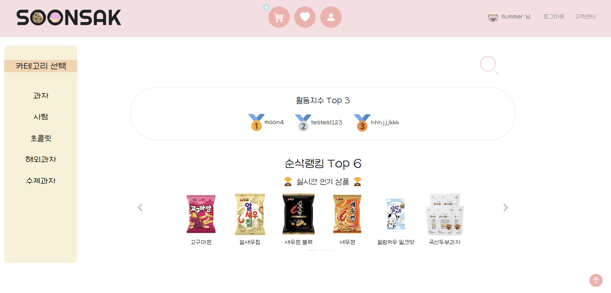

# 🗂️ Semi Project Ⅱ

> 서비스 이름 : 순삭(SOONSAK)
>
> 제작 기간 : 2022-11-09 ~ 2022-11-21
>
> 팀 구성 : 16팀 SOONSAK (이동영, 이순철, 강문주, 박상준, 한가을, 이수경)
>
> 🌐 Link : http://soonsak-env.eba-rnwyi2s3.ap-northeast-2.elasticbeanstalk.com/

## 🫧 Contributors

## ⚙️ Stacks

       

## 📑 Requirements

> 회원제 커뮤니티 서비스를 개발합니다. 아래 조건을 만족해야합니다.

- **CRUD** 구현
- **Staticfiles** 활용 정적 파일(images, CSS, JS) 다루기
- **Django Auth** 활용 회원 관리 구현
- **Media** 활용 동적 파일 다루기
- 모델간 **1 : N** 관계 매핑 코드 작성 및 활용
  - 유저 - 리뷰
  - 유저 - 댓글
  - 리뷰 - 댓글

## 🔥 Issues

## ✒️ Reviews

- **이동영** :
  1. GOOD
     - 계획한대로 기본+추가 기능구현이 되었다.
     - 팀원의 역할 분담이 잘되었다.
     - 계획한대로 일정을 진행되서 일정내에 프로젝트를 완성했다.
     - 본격적인 개발전 개발 계획 회의를 긴시간 진행해서 개발중 의견 충돌이 없었다.
  2. ㅠㅠ
     - 하루~이틀에 한번 팀원 전체가 모여 코드리뷰를 했으면 더 좋았을것 같다.
     - 글작성 CRUD, 회원가입은 테스트 코드를 작성했으면 개발 시간을 단축할 수 있었을 것 같다.
  3. 팀에게
     - 팀원들 모두 고생했다. 모두 각자 역할을 잘 해줬다. 모두가 주어진 역할 뿐만 아니라 더 많은 것을 프로젝트에 담으력도 노력해줘서 프로젝트가 잘 완성될 수 있었다. 팀원 누구라도 다음에 또 같은 팀이 된다면 좋은 프로젝트가 될 것 같다.
- **이순철** : 프로젝트 기획부터 꼼꼼히 회의하여 계획했던 기능들이 다 구현되었다는 점에 우리 팀원들의 실력에 놀랐고 하나하나 만들어지는 기능과 화면을 보며 부족하다 생각한 나의 실력과 자신감도 성장했다는 걸 느끼게 되었습니다. 프로젝트가 완성 된 지금에는 나도 한 사람 몫을 할 수 있다는 생각으로 마지막 프로젝트에 도전 할 수 있을 것 같습니다.
- **강문주** : 팀원들의 배려와 열의 덕분에 많이 배우고 부족하지만 열심히 할 수 있었습니다. 혼자서는 할 수 없었던 일들을 이뤄낸 멋진 팀원들에게 함께 하는 것만으로도 감사한 프로젝트였습니다. 
- **박상준** : 부족한 부분이 많았지만 팀원분들이 도와주셔서 잘 마무리 되었다고 생각합니다. 앞으로 스스로 할 수 있게끔 더 공부해서 프로젝트에 도움이 되면 좋겠습니다.
- **한가을** : 처음으로 진행해보는 팀 프로젝트여서 걱정을 많이 했는데 다른 팀원 분들이 다들 잘 도와주셔서 잘 마무리 할 수 있었습니다. 구현해내고 싶은 기능을 완벽하게 구현해내지 못해서 아쉬움도 남지만 이번 프로젝트를 계기로 다음에는 더 열심히 공부해서 꼭 구현해 보겠습니다. 
- **이수경** : 백엔드 포지션에 익숙하던 제가 프론트엔드 개발 업무를 맡아 이렇게 열심히 참여한 적이 처음이고, AWS 를 활용해서 배포 업무를 담당한 것도 처음이었기에 정말 특별한 경험이었습니다. 5개의 앱, 23개의 템플릿을 관리하는게 쉽진 않았지만, 모든 팀원이 기능 구현과 화면 구현 상황을 노션에 꼼꼼히 기록한 덕분에 목표했던 추가 기능들까지 완성할 수 있었습니다.
